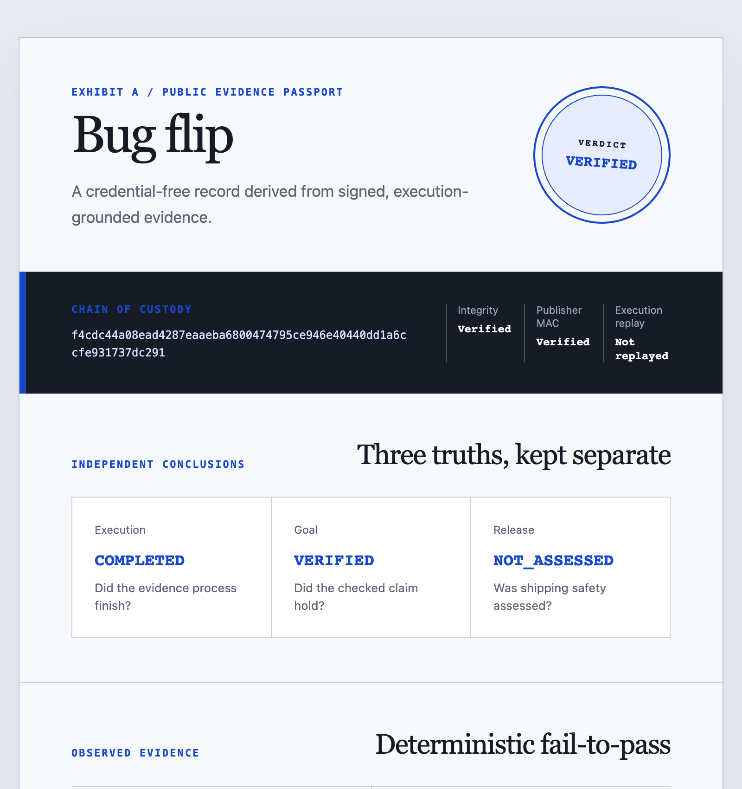
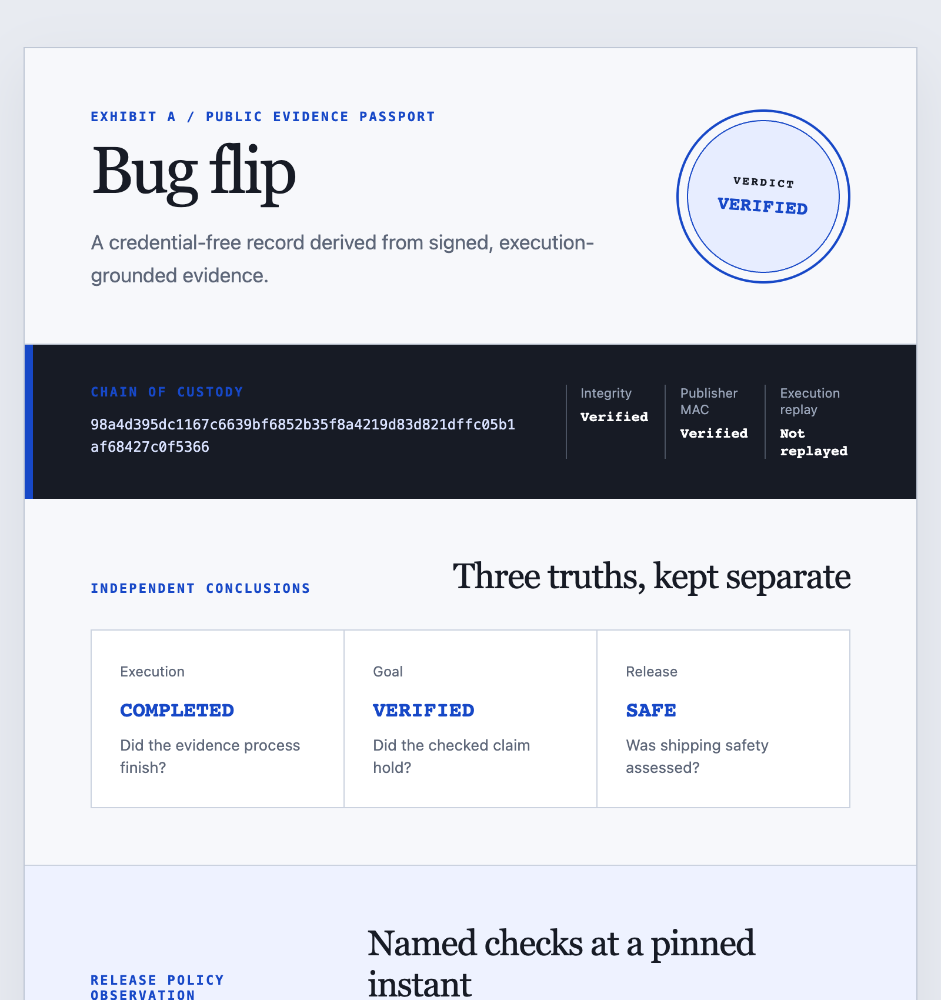

<div align="center">

# Exhibit A

**An evidence engine for code that is only allowed to speak with proof.**

*Every claim it makes is a rerunnable test: red on the bug, green on the fix. When it cannot prove one, it stays silent.*

*Every proof it produces is also open data for AI-for-software-engineering (AI4SE) research.*


<sub>Real output from <code>python3 -m exhibit_a.cli repro --replay</code> on the two checked-in inventory Cases. No model or code execution. <a href="./docs/MEDIA_PROVENANCE.md#verdict-pair">Commands and capture provenance</a></sub>

</div>

---

> **Measured real-fix coverage (September 2026): the judge was reached on 15/30 fixes
> (50.0%); 7/30 VERIFIED (23.3%) and 0/30 were PARTIAL.** On the recorded Docker
> `linux/arm64` platform, dependency installation blocked the other 15; eight judged
> candidates were honestly rejected. This is the first credible product signal, but the
> current implementation remains a **research instrument**, not a broad-coverage
> product. [Read the complete preregistered v7 pilot, probe, dependency breakdown, and
> exclusions.](./docs/FIX_COVERAGE_RESULTS.md)

## The problem

AI code reviewers have a trust problem. They cry wolf. A bot that flags ten "issues" with
eight of them noise trains developers to skim past all ten, and the one real bug ships.
The failure mode is not missing bugs. It is alert fatigue that collapses trust in the tool.

Every mainstream reviewer optimizes for catch rate and reports a confidence score.
Confidence is not proof. A 90%-confident wrong comment is still a wrong comment.

## The idea

Exhibit A inverts the contract. It is governed by **one rule**:

> It may only report a bug if it can hand you a **runnable test that fails on the broken
> code and passes on the fix.** No proof, no comment. When it cannot prove a suspicion, it
> stays **silent** and records why.

This is enforced by construction rather than by a threshold. A deterministic, model-free
**flip check** is the sole judge of what counts as evidence, and it trusts execution logs
over anything the model claims. The result is a reviewer whose every statement is backed
by an artifact you can re-run in seconds, and whose silence is a feature rather than a
failure.

The same discipline produces a second output. Because every proof is an
execution-validated fail-to-pass test tied to a specific commit, each one is a
ready-made **benchmark instance**. Exhibit A doubles as a minting press for the
contamination-free datasets that AI4SE research needs, and it
emits research-grade artifacts as a byproduct of doing its day job.

## Two modes, one engine

| Mode | Input | Output |
|------|-------|--------|
| **Detective** | A stack trace, error, or bug report plus a repo | An autonomously reproduced, verified fail-to-pass test |
| **Prosecutor** | A pull request | A review comment only when a flip is proven |

Both run on the shared **Evidence Engine**:

```
claim + code state(s)
    -> hypothesize (Codex / GPT-5.6, read-only)
    -> generate candidate test (pass-then-invert)
    -> execute both states in a sandbox
    -> FLIP CHECK  (deterministic, no model)
    -> VERIFIED Case File   or   UNCERTAIN (Silence Log)
```

### See a real investigation

The recording below is a current-code provider run from claim to deterministic verdict.
It checks the existing suite, asks the provider for a test, observes five matching failures
on the reported state and a pass on the fixed state, minimizes the evidence, and ends
`VERIFIED`. The first candidate cleared the gate, so this run did not need a rejection or
retry.


<sub>Command: <code>/opt/homebrew/bin/python3 -m exhibit_a.cli repro /tmp/ea/t --fixed /tmp/ea/b --claim 'stock_for should return 0 for a missing SKU, not KeyError' --expect KeyError --out /tmp/ea/c --no-sandbox --events</code>. The inputs were byte-for-byte temporary copies of the checked-in inventory fixtures. One provider wait was capped at 15 seconds in playback, and the recording was trimmed only after the verdict, before the final Case JSON. <a href="./docs/MEDIA_PROVENANCE.md#real-provider-investigation">Full provenance</a></sub>

## What it proves, and what it does not

The flip check proves that behavior **changed** between two states. It does not prove the
change is a **bug**, since most changes are intentional. A separate intent step labels a
proven change as a regression or an expected one, and that label never overrides the
execution result.

Verdicts are tiered so the tool never overclaims:

| Verdict | Meaning |
|---------|---------|
| `VERIFIED` | Fails on the broken code, passes on the fix. A full flip. |
| `PARTIAL` | A deterministic, signature-matched failure with no known-good state to compare against. |
| `FAILED` | Reserved for deterministic evidence that disproves the stated goal; the bug-repro judge does not emit it yet. |
| `UNCERTAIN` | Nothing cleared the gate. Honest silence. |

**Intended scope:** deterministic functional bugs in Python repositories that build in a
sandbox. In the latest preregistered, fresh-corpus pilot, 15/30 reached the judge and 7/30
produced VERIFIED evidence. Dependency installation blocked the other 15, while eight
judged candidates were rejected for infrastructure, vacuity, wrong failure signature, or
tamper. That makes the scope measurable and promising, but not yet broadly demonstrated.
It cannot speak to race conditions, performance regressions, or most security issues, and
it stays silent instead of guessing.

## Open science

The evidence discipline that makes Exhibit A trustworthy also makes it a data engine.
Every verified Case is an execution-validated fact about real code, and the project turns
those facts into open research assets.

Evidence collection is exposed through [typed, read-only connectors](docs/CONNECTORS.md).
Each connector emits raw facts and hash-linked provenance, while verdict authority stays
with deterministic claim-specific code.
The first non-test connector reads immutable commit and changed-path metadata from an
already-local Git checkout without fetching or exposing author identities.

The second claim type begins with a [deterministic behavior-preservation judge](docs/BEHAVIOR_REFACTOR.md):
trusted contracts run before and after a refactor, and stable differences produce an
evidence-backed `FAILED` rather than being confused with infrastructure failure.

- **Contamination-free benchmarks.** Each `VERIFIED` Case carries a commit SHA, a
  fail-to-pass test, and a date, which is exactly the shape of a SWE-bench-style instance.
  Because instances are minted continuously from live fixes and tagged by date, they can
  be filtered against any model's training cutoff, so the benchmark does not rot into the
  training set.
- **Signed, replayable evidence bundles.** A Case can be exported as a self-contained
  bundle (pinned commits, the test, the run command, logs, and content hashes) that anyone
  can re-execute and verify offline. The versioned EEF supports bug-flip and repeated
  before/after refactor claims, claim-bound remote receipts, and an optional public-key
  signature profile while retaining verification for earlier archives. See
  [`docs/EEF.md`](./docs/EEF.md).
- **Negative results as a dataset.** The Silence Ledger records what the engine suspected
  but could not prove. Nobody publishes what reproduction tools fail to reproduce, which
  makes this a genuinely novel research asset. See
  [`docs/RESEARCH_ASSETS.md`](./docs/RESEARCH_ASSETS.md).
- **Auditing the benchmarks themselves.** The same mutation machinery measures how strong
  a benchmark's own tests are, which surfaces the weak-oracle problem in existing suites.
  See [`docs/ORACLE_GAP.md`](./docs/ORACLE_GAP.md).

Datasets are released under CC-BY-4.0 with a per-instance SPDX license tag, and bundles
are built to be mirrored to a DOI-bearing archive for artifact evaluation.

## Architecture

A monorepo with a hard boundary between the **model** that proposes and the **judge** that
admits. The model is fallible. The judge is deterministic.

```
engine/                         Python, the Evidence Engine
  exhibit_a/
    models/case.py              the Case data model (shared contract, mirrored in TS)
    hypothesis/generator.py     the model seam where Codex/GPT-5.6 plugs in
    hypothesis/intent.py        separate, fallible intent judge (never gates evidence)
    executor/                   swappable sandbox: docker_exec (real), local_exec (dev)
    verdict/flip_check.py       PURE, DETERMINISTIC admissibility gates, the sole judge
    verdict/...                 mutation scoring, minimization, evidence strength (scores, not gates)
    engine.py                   orchestrator
    cli.py                      the exhibit-a CLI
web/                            Next.js 15, React 19, Tailwind, the "case file" UI
  src/app/api/investigate/...   drives the engine, streams each run over SSE
fixtures/                       tiny buggy/fixed repo pairs for offline runs
```

**Security posture:** untrusted repos and PR text are assumed hostile.

- Executors run against a **disposable copy** of the checkout, so source is never mutated.
- Runs are containerized by default; host execution is an explicit `--no-sandbox` opt-in,
  and the web API never offers the choice.
- Docker runs are network-off, capability-dropped, `no-new-privileges`, read-only rootfs.
- All untrusted input (repo URL, SHAs, claim text, model-generated patches) reaches
  `git` and shells as **argv only**, never string-interpolated, never `shell=True`.
- Remote intake is **HTTPS-only**, SHAs are hex-validated, and git hooks are disabled.
- Candidate run-commands are gated to a single scoped pytest file before execution.
- The web API is inert until a token is configured, bounds concurrency and run time,
  and accepts local repository paths only inside an explicitly configured root.

## Setup

**Just evaluating?** The images and recordings above need only a browser. The checked-in
HTML passports below are standalone, credential-free files. Replaying a sealed Case needs
Python, but neither Docker nor a model.

**For a full local run:** Python 3.11+, Node 18+ for the web UI, and Docker for sandboxed
execution. `--no-sandbox` trades containment for host execution and is only for checkouts
you trust.

### Engine

```bash
cd engine
pip install -e ".[dev,public-signatures]"   # public-signatures adds the Ed25519 backend
python3 -m pytest -q             # proves the flip check and verdicts end to end
```

### Web UI

```bash
cd web
npm install
export EXHIBIT_A_API_TOKEN=$(openssl rand -hex 24)   # required; routes are inert without it
export EXHIBIT_A_LOCAL_ROOT=$(cd .. && pwd)          # optional; enables local-path intake
npm run dev                      # http://localhost:3000
```

The routes that drive the engine or write research labels refuse every request until
`EXHIBIT_A_API_TOKEN` is set, so an unconfigured deployment is inert rather than open.
The page is served the same token so the UI can call them, which makes the API exactly
as private as the page — put real authentication in front of the page for any deployment
someone else can reach. Local repository paths are rejected unless `EXHIBIT_A_LOCAL_ROOT`
names the directory investigations may read; remote HTTPS intake needs no such setting.
`EXHIBIT_A_MAX_CONCURRENT` (default 2) and `EXHIBIT_A_RUN_TIMEOUT_S` (default 1800) bound
how much work one caller can start.

## Usage

```bash
cd engine

# 1) Run a live investigation against local buggy/fixed checkouts
python3 -m exhibit_a.cli repro ../fixtures/buggy_inventory \
  --fixed ../fixtures/fixed_inventory \
  --claim "stock_for should return zero for an unknown SKU instead of raising KeyError" \
  --expect KeyError --json --no-sandbox

# 2) A real repository at two commits (base is buggy, fix is the fixing commit or PR head)
python3 -m exhibit_a.cli repro https://github.com/org/repo.git \
  --base-sha <buggy-sha> --fix-sha <fix-sha> \
  --claim "describe the regression" --json

# 3) Deterministic replay of a sealed, known-good Case (no model, no execution)
python3 -m exhibit_a.cli repro --replay ../fixtures/cases/inventory_proven.json --json

# 4) Offline pipeline smoke test (deterministic stub instead of the model)
python3 -m exhibit_a.cli repro ../fixtures/buggy_slice \
  --fixed ../fixtures/fixed_slice --claim "..." --offline --no-sandbox
```

`--no-sandbox` appears only on the in-repo fixtures: they are trusted, and carry no
lockfile for the pinned-image path to build from. Real repositories run sandboxed.

The `--offline` example is a pipeline smoke test, not a VERIFIED demo. Its deterministic
stub cannot import or exercise the code under test, so the expected result is `UNCERTAIN`
with an explicit silence reason. Use the sealed replay or a configured provider to see a
VERIFIED result.

The web API route `/api/investigate` drives the same engine and **streams each execution
over SSE**, so the UI shows the phases, every execution, any rejected candidate or
refinement, and the terminal Case. A retry appears only when the provider actually returns
one. The interface supports local and two-SHA git intake, the Prosecutor evidence gate,
and a private Silence Ledger. [Watch a real stream](./docs/overview.md#the-web-case-file)
that rejects a candidate and ends in honest silence.

Beyond `repro`, the CLI exposes the research surface as opt-in subcommands. These include
`bundle`, `refactor-bundle`, and `verify` for signed, replayable evidence bundles,
`passport` and `passport-html` for credential-free public trust artifacts,
`release-evidence` for a pinned CI-policy EEF plus JSON/HTML passport, `study` for
reproducibility, `self-audit` for the false-conviction rate on innocent refactors, and
`fix-coverage` for the fraction of mechanically selected real fixes the engine can prove,
and `oracle-gap` for benchmark oracle strength. See the
[documentation site](https://suryanshss1011.github.io/Exhibit-A/) for each.

### Dogfooded on Exhibit A's own history

The checked-in [timeout-verdict example](./examples/dogfood/timeout_false_verified/README.md)
pins a real historical defect: before `1f9473f`, timed-out target executions could be
admitted as evidence. Its injected regression test fails three times on the buggy snapshot
and passes on the fixed snapshot, then the current deterministic judge mints the published
[JSON passport](./examples/dogfood/timeout_false_verified/timeout_false_verified.passport.json)
and standalone [HTML passport](./examples/dogfood/timeout_false_verified/timeout_false_verified.passport.html).
The private source-bearing EEF is intentionally not published.



<sub>Rendered directly from the checked-in standalone <a href="./examples/dogfood/timeout_false_verified/timeout_false_verified.passport.html"><code>timeout_false_verified.passport.html</code></a>, with no server or credentials. <a href="./docs/MEDIA_PROVENANCE.md#public-passports">Capture provenance</a></sub>

The checked-in [CI release-truth example](./examples/dogfood/exhibit_a_ci/README.md)
adds a frozen, normalized GitHub observation for a public Exhibit A commit. Its v2
[JSON passport](./examples/dogfood/exhibit_a_ci/exhibit_a_ci.passport.json) and standalone
[HTML passport](./examples/dogfood/exhibit_a_ci/exhibit_a_ci.passport.html) keep the
independent `VERIFIED` bug verdict separate from the bounded `SAFE` result: the latter says
only that the named `engine` and `web` checks passed at collection time, not that the code
was correct.



<sub>Rendered directly from the checked-in standalone <a href="./examples/dogfood/exhibit_a_ci/exhibit_a_ci.passport.html"><code>exhibit_a_ci.passport.html</code></a>, with no server or credentials. <a href="./docs/MEDIA_PROVENANCE.md#public-passports">Capture provenance</a></sub>

## How Codex and GPT-5.6 were used

Codex with **GPT-5.6 Sol** is both the thing this was built with and a first-class
component of the product.

- **As a product component, the hypothesis generator.** Inside the engine, Codex runs in a
  **read-only sandbox** and does exactly one job. It localizes, plans, drafts a passing
  test, inverts it to fail-on-bug (pass-then-invert), and refines on execution feedback. It
  **proposes** reproductions. It **never decides a verdict.** The deterministic flip check
  alone admits a Case as `VERIFIED`, from execution logs, so the product's honesty guarantee
  holds regardless of how the model behaves. This model-versus-judge split is the core
  design.
- **As a provider boundary.** Proposal transports normalize structured output and record
  requested and confirmed runtime model identity separately. Missing backend telemetry is
  an explicit `unknown_*` value, never an omitted field or an inferred identity. CLI and
  direct-HTTP adapters have distinct containment requirements; see
  [Model provider boundary](./docs/PROVIDERS.md).
- **As the implementation partner.** Codex was the pair-programmer for the engine, the
  security boundaries, the test suite, and the streaming UI, with every change gated behind
  the same tests and lint the CI runs.

The division of labor mirrors the product's own thesis. The model reasons, but only
execution is allowed to speak.

## Status

This is a working research prototype with a verified deterministic core, not yet a
broad-coverage product. The engine and typed web test suites are green in CI, which runs
engine lint, format, and tests alongside the web build.
The deterministic verdict core, Docker sandboxing, two-SHA git intake, git-bisect culprit
attribution, mutation scoring, evidence minimization, and a full research-instrumentation
layer are implemented and tested.

## Documentation

Deep-dives live in [`docs/`](./docs/), also published as a
[docs site](https://suryanshss1011.github.io/Exhibit-A/).

- [Operations](./docs/OPERATIONS.md)
- [Executable Evidence Format](./docs/EEF.md)
- [Public evidence passport](./docs/PASSPORT.md)
- [Evidence strength](./docs/EVIDENCE_STRENGTH.md)
- [Mutation testing](./docs/MUTATION_TESTING.md)
- [Minimization](./docs/MINIMIZATION.md)
- [Self-audit](./docs/SELF_AUDIT.md)
- [Oracle-gap probe](./docs/ORACLE_GAP.md)
- [Reproducibility study](./docs/REPRODUCIBILITY_STUDY.md)
- [Real-fix coverage study](./docs/FIX_COVERAGE_STUDY.md)
- [Real-fix coverage pilot results](./docs/FIX_COVERAGE_RESULTS.md)
- [Research assets](./docs/RESEARCH_ASSETS.md)
- [Bug identity](./docs/BUG_IDENTITY.md)
- [Archaeology](./docs/ARCHAEOLOGY.md)
- [Triangulation](./docs/TRIANGULATION.md)
- [Property escalation](./docs/PROPERTY_ESCALATION.md)
- [Environment dataset](./docs/ENVIRONMENT_DATASET.md)
- [Media provenance](./docs/MEDIA_PROVENANCE.md)

[`AGENTS.md`](./AGENTS.md) is the contract for the Codex-driven generator.

## License and citation

The toolkit is MIT ([`LICENSE`](./LICENSE)). Cite it via [`CITATION.cff`](./CITATION.cff).
Minted datasets use CC-BY-4.0 with a per-instance SPDX license tag, as described in
[Open science](#open-science) above.
