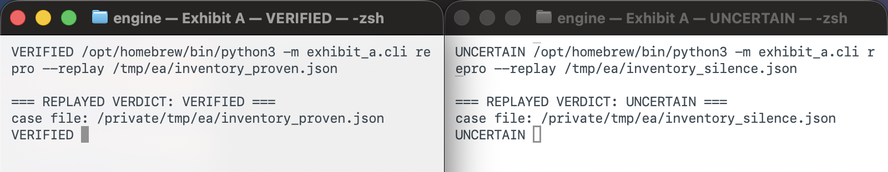

# Documentation

Exhibit A has one rule: a runnable fail-to-pass test, or silence.

A VERIFIED Case shows that an exact generated test failed on the reported state for the
expected reason and passed on the fixed state under deterministic execution. It does not
prove developer intent, complete program correctness, universal causality, or that a
candidate repair should be merged. Research scores and study reports are descriptive.
They never override the deterministic flip check.

Produced by `python3 -m exhibit_a.cli repro --replay` on the checked-in
`inventory_proven.json` and `inventory_silence.json` Cases. Replay makes no model call and
executes no repository code. See the [exact commands and capture record](./MEDIA_PROVENANCE.html#verdict-pair).

Read the [project overview](./overview.html) for the full product pitch, architecture,
setup instructions, and Codex usage.

## Evidence engine

- [Operational contract](./OPERATIONS.html)
- [Model provider boundary](./PROVIDERS.html)
- [Evidence connectors](./CONNECTORS.html)
- [Behavior-preserving refactor claims](./BEHAVIOR_REFACTOR.html)
- [Mutation-testing foundation](./MUTATION_TESTING.html)
- [Verified evidence minimization](./MINIMIZATION.html)
- [Evidence strength scalar](./EVIDENCE_STRENGTH.html)

## Open science and EEF

- [Executable Evidence Format](./EEF.html)
- [Public evidence passport](./PASSPORT.html)
- [Private research assets](./RESEARCH_ASSETS.html)
- [Media provenance and authenticity](./MEDIA_PROVENANCE.html)

## Research instruments

- [Real-fix coverage study](./FIX_COVERAGE_STUDY.html)
- [Real-fix coverage pilot results](./FIX_COVERAGE_RESULTS.html)
- [Historical pilot v6 results](./FIX_COVERAGE_V6_RESULTS.html)
- [Historical pilot v5 results](./FIX_COVERAGE_V5_RESULTS.html)
- [Historical pilot v4 results](./FIX_COVERAGE_V4_RESULTS.html)
- [Reproducibility-of-reproduction study](./REPRODUCIBILITY_STUDY.html)
- [Adversarial self-audit](./SELF_AUDIT.html)
- [Oracle-gap probe](./ORACLE_GAP.html)
- [Environment-inference dataset](./ENVIRONMENT_DATASET.html)
- [Execution-based bug identity](./BUG_IDENTITY.html)
- [Cross-version evidence archaeology](./ARCHAEOLOGY.html)
- [Counterfactual patch triangulation](./TRIANGULATION.html)
- [Property-based escalation](./PROPERTY_ESCALATION.html)
