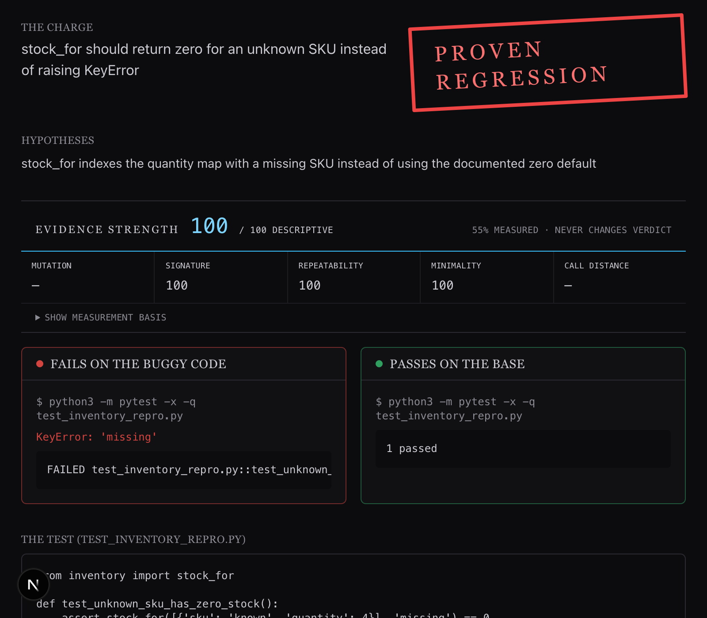

# Exhibit A

**An evidence engine for code that is only allowed to speak with proof.**

Every claim it makes is a rerunnable test: red on the bug, green on the fix. When it cannot
prove one, it stays silent. Every proof it produces is also open data for
AI-for-software-engineering (AI4SE) research.

## The problem

AI code reviewers have a trust problem. They cry wolf. A bot that flags ten "issues" with
eight of them noise trains developers to skim past all ten, and the one real bug ships.
The failure mode is not missing bugs. It is alert fatigue that collapses trust in the tool.
Every mainstream reviewer optimizes for catch rate and reports a confidence score.
Confidence is not proof. A 90%-confident wrong comment is still a wrong comment.

## The idea

Exhibit A inverts the contract. It is governed by one rule: it may only report a bug if it
can hand you a runnable test that fails on the broken code and passes on the fix. No proof,
no comment. When it cannot prove a suspicion, it stays silent and records why.

This is enforced by construction rather than by a threshold. A deterministic, model-free
flip check is the sole judge of what counts as evidence, and it trusts execution logs over
anything the model claims. The result is a reviewer whose every statement is backed by an
artifact you can re-run in seconds, and whose silence is a feature rather than a failure.

The same discipline produces a second output. Because every proof is an execution-validated
fail-to-pass test tied to a specific commit, each one is a ready-made benchmark instance.
Exhibit A doubles as a minting press for the contamination-free datasets that AI4SE research
needs, and it emits research-grade artifacts as a byproduct of doing its day job.

## Two modes, one engine

| Mode | Input | Output |
|------|-------|--------|
| **Detective** | A stack trace, error, or bug report plus a repo | An autonomously reproduced, verified fail-to-pass test |
| **Prosecutor** | A pull request | A review comment only when a flip is proven |

Both run on the shared Evidence Engine:

```
claim + code state(s)
    -> hypothesize (Codex / GPT-5.6, read-only)
    -> generate candidate test (pass-then-invert)
    -> execute both states in a sandbox
    -> FLIP CHECK  (deterministic, no model)
    -> VERIFIED Case File   or   UNCERTAIN (Silence Log)
```

## See it run

### A real provider investigation

This current-code run checks the existing suite, asks the configured provider for a test,
observes five matching failures on the reported state and a pass on the fixed state,
minimizes the evidence, and ends `VERIFIED`. The first candidate cleared the gate, so this
particular run had no rejection or retry.


Command: `/opt/homebrew/bin/python3 -m exhibit_a.cli repro /tmp/ea/t --fixed /tmp/ea/b
--claim 'stock_for should return 0 for a missing SKU, not KeyError' --expect KeyError --out
/tmp/ea/c --no-sandbox --events`. The two inputs were byte-for-byte temporary copies of
the checked-in inventory fixtures. One provider wait is capped at 15 seconds in playback;
the only tail trim removes output after the real verdict, before the final Case JSON. No
events were rewritten, reordered, or spliced. See the [capture record](./MEDIA_PROVENANCE.html#real-provider-investigation).

### The web case file

The video is one continuous final minute of a genuine 108.5-second SSE investigation at
`http://127.0.0.1:3000/`. A deliberately incorrect claim is tested five times against two
identical fixture states. It fails on both, so the deterministic judge rejects it as
fail-to-fail; the provider offers no refined candidate, and the UI ends `UNCERTAIN` with a
Silence Log. There is no retry to show because none happened.

<video controls muted playsinline preload="metadata" poster="{{ '/assets/web-case-file.png' | relative_url }}" width="1280" style="width: 100%; max-width: 1280px" aria-label="Real web investigation stream ending in an UNCERTAIN verdict">
  <source src="{{ '/assets/web-investigation-stream.mp4' | relative_url }}" type="video/mp4">
  Your browser cannot play the embedded video. <a href="{{ '/assets/web-investigation-stream.mp4' | relative_url }}">Open the MP4 directly.</a>
</video>

Capture input: claim `stock_for should return one for an unknown SKU instead of zero`,
with both reported and fixed paths set to `fixtures/sandbox_smoke`. The first 48.5 seconds
of initial provider wait were trimmed; the published 59.93 seconds have no internal cut,
splice, reordered frame, narration, or audio track. See the [capture record](./MEDIA_PROVENANCE.html#web-investigation-stream).



The still is a separate real run of the UI's **Replay proof** action at
`http://127.0.0.1:3000/`, using the checked-in `inventory_proven.json` sealed Case. It is a
no-execution replay for inspecting the finished case-file layout, not a frame from the live
investigation above.

## What it proves, and what it does not

The flip check proves that behavior changed between two states. It does not prove the change
is a bug, since most changes are intentional. A separate intent step labels a proven change
as a regression or an expected one, and that label never overrides the execution result.

Verdicts are tiered so the tool never overclaims:

| Verdict | Meaning |
|---------|---------|
| `VERIFIED` | Fails on the broken code, passes on the fix. A full flip. |
| `PARTIAL` | A deterministic, signature-matched failure with no known-good state to compare against. |
| `FAILED` | Reserved for deterministic evidence that disproves the stated goal; the bug-repro judge does not emit it yet. |
| `UNCERTAIN` | Nothing cleared the gate. Honest silence. |

**Scope:** deterministic functional bugs in Python repos that build in a sandbox. It cannot
speak to race conditions, performance regressions, or most security issues, and it stays
silent instead of guessing.

## Open science

The evidence discipline that makes Exhibit A trustworthy also makes it a data engine. Every
verified Case is an execution-validated fact about real code, and the project turns those
facts into open research assets.

- **Contamination-free benchmarks.** Each `VERIFIED` Case carries a commit SHA, a fail-to-pass
  test, and a date, which is exactly the shape of a SWE-bench-style instance. Because
  instances are minted continuously from live fixes and tagged by date, they can be filtered
  against any model's training cutoff, so the benchmark does not rot into the training set.
- **Signed, replayable evidence bundles.** A Case can be exported as a self-contained bundle
  (pinned commits, the test, the run command, logs, and content hashes) that anyone can
  re-execute and verify offline. See the [Executable Evidence Format](./EEF.html).
- **Negative results as a dataset.** The Silence Ledger records what the engine suspected but
  could not prove. Nobody publishes what reproduction tools fail to reproduce, which makes
  this a genuinely novel research asset. See [Private research assets](./RESEARCH_ASSETS.html).
- **Auditing the benchmarks themselves.** The same mutation machinery measures how strong a
  benchmark's own tests are, which surfaces the weak-oracle problem in existing suites. See
  the [Oracle-gap probe](./ORACLE_GAP.html).

Datasets are released under CC-BY-4.0 with a per-instance SPDX license tag, and bundles are
built to be mirrored to a DOI-bearing archive for artifact evaluation.

## Architecture

A monorepo with a hard boundary between the model that proposes and the judge that admits.
The model is fallible. The judge is deterministic.

```
engine/                         Python, the Evidence Engine
  exhibit_a/
    models/case.py              the Case data model (shared contract, mirrored in TS)
    hypothesis/generator.py     the model seam where Codex/GPT-5.6 plugs in
    hypothesis/intent.py        separate, fallible intent judge (never gates evidence)
    executor/                   swappable sandbox: docker_exec (real), local_exec (dev)
    verdict/flip_check.py       PURE, DETERMINISTIC admissibility gates, the sole judge
    verdict/...                 mutation scoring, minimization, evidence strength (scores, not gates)
    engine.py                   orchestrator
    cli.py                      the exhibit-a CLI
web/                            Next.js 15, React 19, Tailwind, the "case file" UI
  src/app/api/investigate/...   drives the engine, streams each run over SSE
fixtures/                       tiny buggy/fixed repo pairs for offline runs
```

**Security posture:** untrusted repos and PR text are assumed hostile.

- Executors run against a disposable copy of the checkout, so source is never mutated.
- Runs are containerized by default; host execution is an explicit `--no-sandbox` opt-in,
  and the web API never offers the choice.
- Docker runs are network-off, capability-dropped, `no-new-privileges`, read-only rootfs.
- All untrusted input (repo URL, SHAs, claim text, model-generated patches) reaches `git`
  and shells as argv only, never string-interpolated, never `shell=True`.
- Remote intake is HTTPS-only, SHAs are hex-validated, and git hooks are disabled.
- Candidate run-commands are gated to a single scoped pytest file before execution.

## Setup

**Just evaluating?** Every artifact above needs only a browser. Replaying a sealed Case
needs Python, but neither Docker nor a model.

**For a full local run:** Python 3.11+, Node 18+ for the web UI, and Docker for sandboxed
execution. `--no-sandbox` trades containment for host execution and is only for checkouts
you trust.

```bash
# Engine
cd engine
pip install -e ".[dev,public-signatures]"   # public-signatures adds the Ed25519 backend
python3 -m pytest -q             # proves the flip check and verdicts end to end

# Web UI
cd web
npm install
export EXHIBIT_A_API_TOKEN=$(openssl rand -hex 24)   # required; routes are inert without it
export EXHIBIT_A_LOCAL_ROOT=$(cd .. && pwd)          # optional; enables local-path intake
npm run dev                      # http://localhost:3000
```

## Usage

```bash
cd engine

# 1) Run a live investigation against local buggy/fixed checkouts
python3 -m exhibit_a.cli repro ../fixtures/buggy_inventory \
  --fixed ../fixtures/fixed_inventory \
  --claim "stock_for should return zero for an unknown SKU instead of raising KeyError" \
  --expect KeyError --json --no-sandbox

# 2) A real repository at two commits (base is buggy, fix is the fixing commit or PR head)
python3 -m exhibit_a.cli repro https://github.com/org/repo.git \
  --base-sha <buggy-sha> --fix-sha <fix-sha> \
  --claim "describe the regression" --json

# 3) Deterministic replay of a sealed, known-good Case (no model, no execution)
python3 -m exhibit_a.cli repro --replay ../fixtures/cases/inventory_proven.json --json
```

`--no-sandbox` appears only on the in-repo fixtures: they are trusted, and carry no
lockfile for the pinned-image path to build from. Real repositories run sandboxed.

## How Codex and GPT-5.6 were used

Codex with **GPT-5.6 Sol** is both the thing this was built with and a first-class component
of the product.

- **As a product component, the hypothesis generator.** Inside the engine, Codex runs in a
  read-only sandbox and does exactly one job. It localizes, plans, drafts a passing test,
  inverts it to fail-on-bug (pass-then-invert), and refines on execution feedback. It
  proposes reproductions. It never decides a verdict. The deterministic flip check alone
  admits a Case as `VERIFIED`, from execution logs, so the product's honesty guarantee holds
  regardless of how the model behaves. This model-versus-judge split is the core design.
- **As the implementation partner.** Codex was the pair-programmer for the engine, the
  security boundaries, the test suite, and the streaming UI, with every change gated behind
  the same tests and lint the CI runs.

The division of labor mirrors the product's own thesis. The model reasons, but only execution
is allowed to speak.

## Status

This is a working, verified system. The engine and typed web test suites are green in CI,
which runs engine lint, format, and tests alongside the web build. The
deterministic verdict core, Docker sandboxing, two-SHA git intake, git-bisect culprit
attribution, mutation scoring, evidence minimization, and a full research-instrumentation
layer are implemented and tested.
